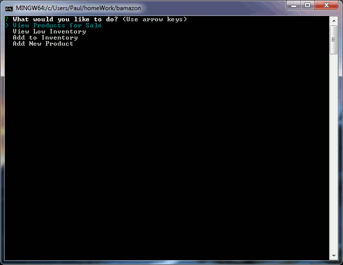

# bamazon
Shopping Node Project
Bamazon is a great suite of software to manage your imaginary sales!

The customer can see what you have in stock, decide which item to purchase, and enter the quantity to purchase.  See an example below:

The manager can view all items in the database, all items with fewer than 5 items in stock, add additional stock, and add new items for sale.  See an example below:

The supervisor can see a summary role up of all sales by department and create a new department.  See an example below:

